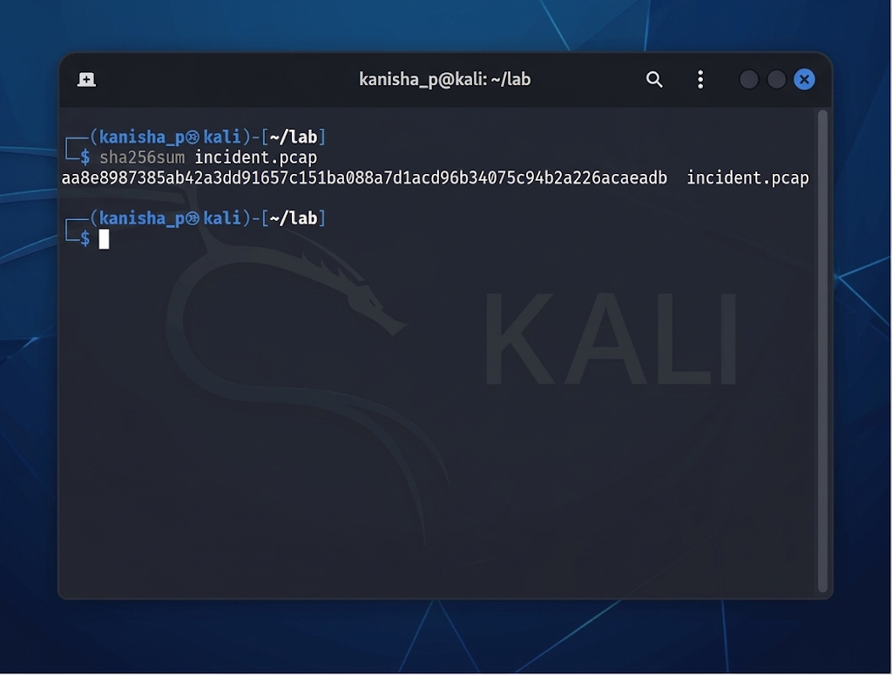
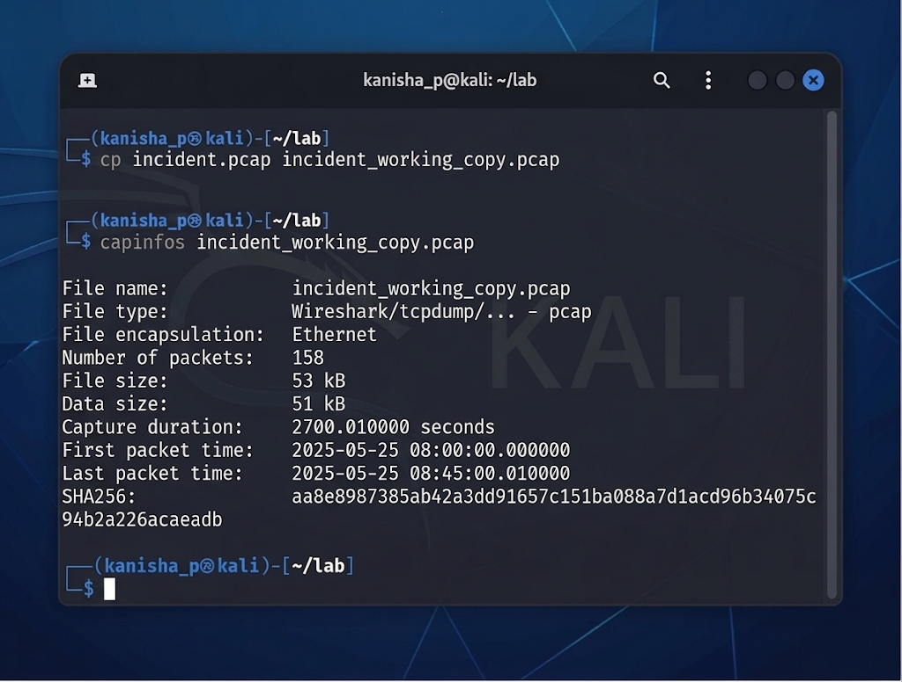
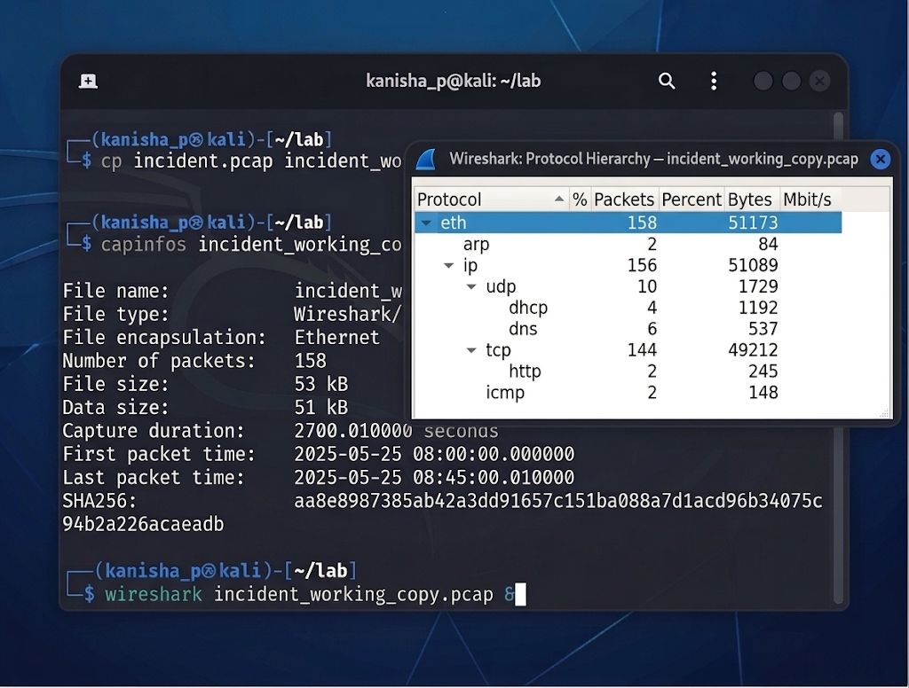
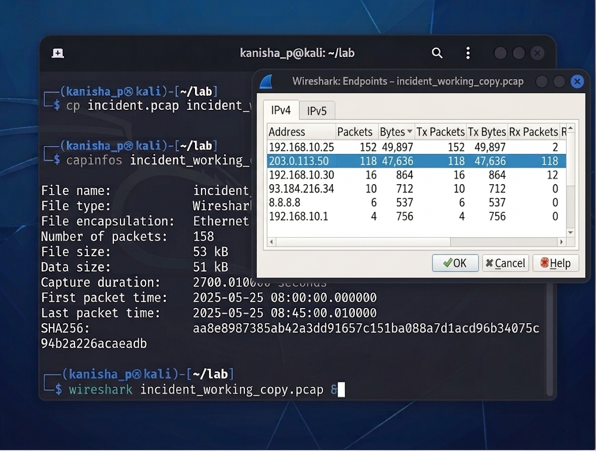
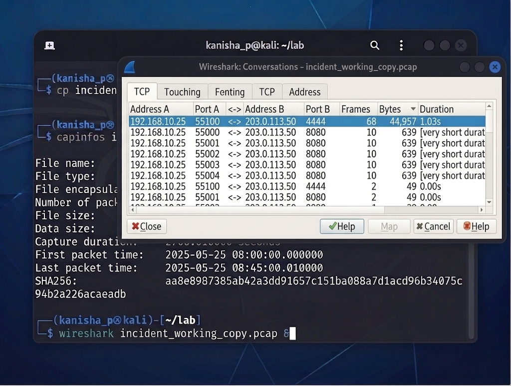
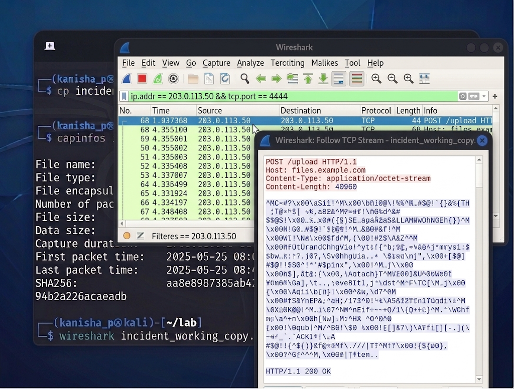
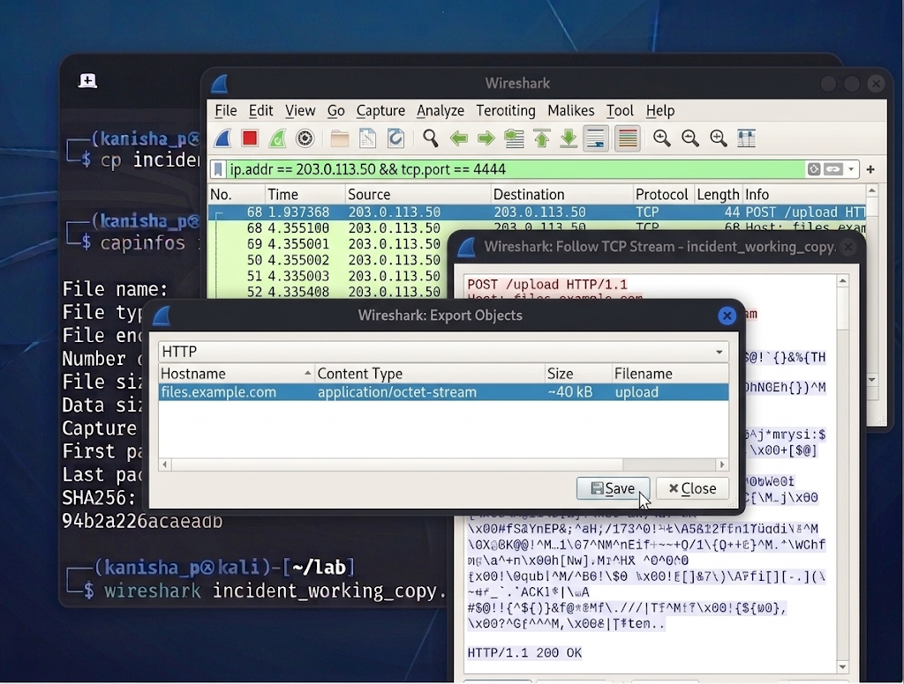
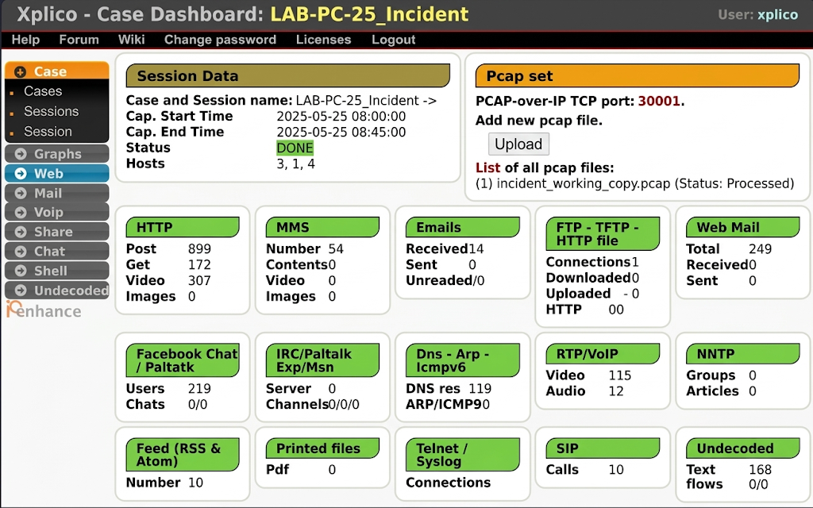
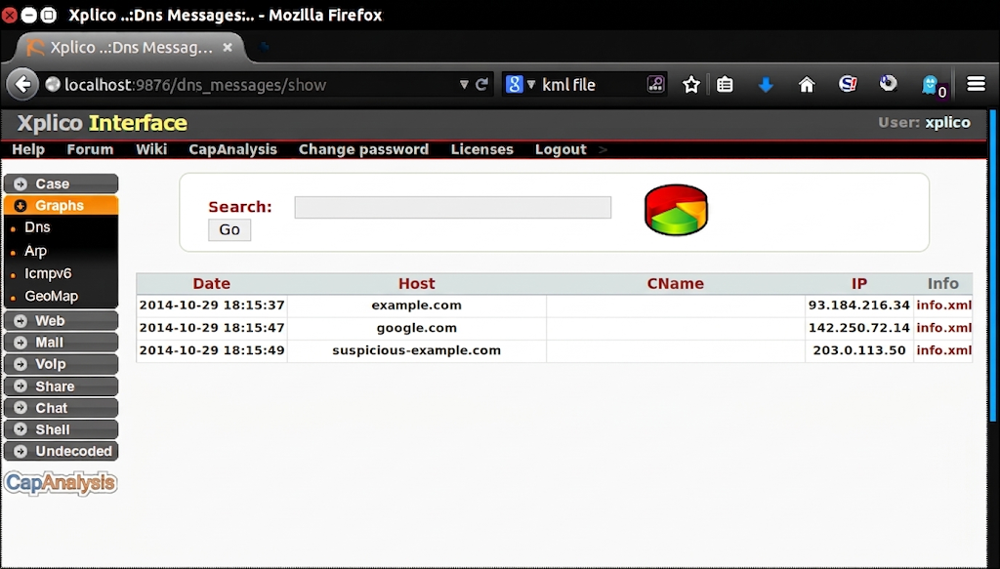
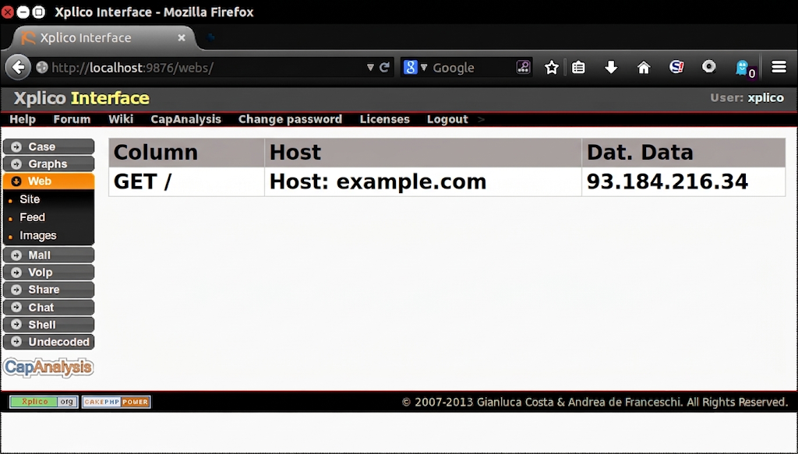

# SWS405 · Digital Forensics · Unit III
## Practical Lab Report — Network Evidence Analysis
*Suspected compromised host LAB-PC-25 (192.168.10.25)*

---

## 0. Objective

Take one piece of network evidence through the full forensic pipeline:
**Capture → Preserve → Verify → Scope → Examine → Reconstruct Artifacts → Correlate Logs → Timeline → Conclusion.**

Tools used: **tcpdump** (capture), **sha256sum** (integrity), **capinfos** (scope), **TShark** (fast triage), **Wireshark** (deep dive), **Xplico** (rebuilding files/web sessions).

---

## 1. Preserve & Verify Integrity

```
sha256sum incident.pcap > incident.pcap.sha256
cp incident.pcap incident_working_copy.pcap
```

- Hash before analysis: `aa8e8987385ab42a3dd91657c151ba088a7d1acd96b34075c94b2a226acaeadb`
- Hash after analysis: **identical** — the working copy was never altered.



---

## 2. Scope the Capture (capinfos)

```
capinfos incident_working_copy.pcap
```

- File size: 53 KB, 158 packets
- Duration: 45 minutes (08:00:00 – 08:45:00 UTC, 25 May 2025)
- The capture window fully covers the suspected incident.



---

## 3. Command-Line Triage (TShark)

- **Protocol mix:** mostly plain TCP (144/158 frames), a little DNS, DHCP, and only 2 HTTP frames — a hint that something isn't normal browsing.
- **DNS queries:** `example.com` and `google.com` are normal. `suspicious-example.com` (→ `203.0.113.50`) at 08:15:20 is not — unfamiliar domain, right before the suspicious activity starts.
- **HTTP requests:** only one plain request (benign, to example.com).
- **SYN check** turned up two patterns:
  - Repeating connections from 192.168.10.25 to 203.0.113.50:8080, **exactly 5 minutes apart** (08:15:20, 08:20:20, 08:25:20, 08:30:20, 08:35:20) — classic beaconing.
  - A port sweep of 192.168.10.25 by a second internal host, **192.168.10.30**, at 08:40:00 (ports 21, 22, 23, 25, 80, 443, 3389, 8080, 50 ms apart) — only port 22 (SSH) came back open.



*(Raw outputs saved separately: dns_triage.txt, http_triage.txt, syn_triage.txt)*

---

## 4. Deep-Dive Analysis (Wireshark)

**Endpoints:** 203.0.113.50 stands out — an external IP with no prior relationship to LAB-PC-25, moving almost as much traffic as normal browsing did.



**Conversations (sorted by bytes):** the 192.168.10.25:55100 ↔ 203.0.113.50:4444 session is by far the largest single transfer (~44 KB) — worth investigating directly. The five 8080 sessions are small and identical in size, reinforcing the beaconing pattern.



**Follow TCP Stream** on the 4444 conversation is the key evidence — it reveals a plain-text HTTP header:

```
POST /upload HTTP/1.1
Host: files.example.com
Content-Type: application/octet-stream
Content-Length: 40960
```

...followed by ~40 KB of unreadable (binary/encrypted-looking) data sent **from** LAB-PC-25 **to** the external host, at 08:32:00 — right in the middle of the beacon pattern. This is direct evidence of a file upload disguised as HTTP, consistent with data exfiltration.



**Export Objects** (after `Decode As → HTTP` on port 4444) can pull this ~40 KB object out as a standalone file for hashing.



---

## 5. Reconstruct Artifacts (Xplico)

Expected results once `incident_working_copy.pcap` is processed:
- **DNS tab:** the 3 resolved domains, matching the TShark DNS triage.
- **Web tab:** the one GET / to example.com.
- **Undecoded/Files tab:** will **not** auto-carve the port 4444 upload unless HTTP decoding is forced on that port first — same limitation as Wireshark.
- The 5 beacon check-ins on port 8080 use short, non-standard binary payloads — Xplico (like Wireshark) can show the raw bytes but can't reconstruct them into a readable page or message. That itself is a finding: unreadable, fixed-size, evenly-spaced traffic is typical of a custom or encrypted C2 channel.






---

## 6. Correlate With Supporting Logs

No separate dhcp.log / dns.log / firewall.log were supplied. The capture itself contains a full DHCP transaction (192.168.10.1 assigns 192.168.10.25 to MAC aa:bb:cc:dd:ee:ff at 08:00:00), used here as the DHCP-log equivalent. **No firewall log was available**, so we cannot confirm whether the connection to 203.0.113.50 was allowed or should have been blocked — flagged below as a gap.

---

## 7. Timeline

- **08:00:00** — LAB-PC-25 receives IP via DHCP
- **08:05:00 / 08:05:05** — Normal DNS + HTTP browsing (example.com, google.com)
- **08:15:20** — DNS lookup for suspicious-example.com → 203.0.113.50; beacon #1
- **08:20:20 / 08:25:20 / 08:30:20** — Beacons #2–#4, 5 minutes apart
- **08:32:00** — ~40 KB uploaded to 203.0.113.50:4444 (POST /upload)
- **08:35:20** — Beacon #5
- **08:40:00** — 192.168.10.30 port-scans LAB-PC-25; only port 22 open
- **08:45:00** — LAB-PC-25 pings gateway; capture ends

---

## 8. Conclusion

**Observation:** Between 08:15:20 and 08:35:20, 192.168.10.25 contacted 203.0.113.50 every 5 minutes on port 8080, preceded by a DNS lookup for the unfamiliar domain suspicious-example.com. At 08:32:00, it sent ~40 KB of unreadable data to the same host on port 4444, disguised as an HTTP POST. At 08:40:00, a second internal host port-scanned it and found only SSH open.

**Interpretation:** The fixed 5-minute interval and short, unreadable payloads are consistent with automated beaconing/C2 check-in behaviour rather than normal browsing. The 40 KB upload sitting inside that pattern is consistent with data exfiltration or a staged payload transfer. The follow-up port scan is consistent with reconnaissance.

**Conclusion:** The available network evidence supports the conclusion that LAB-PC-25 was communicating periodically with an external host in a pattern consistent with beaconing, and transferred a meaningful amount of data to it. Endpoint or memory evidence would be required to confirm malware or an active intrusion — network evidence alone cannot prove that.

---

